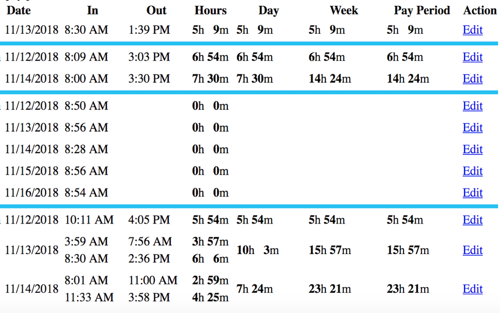
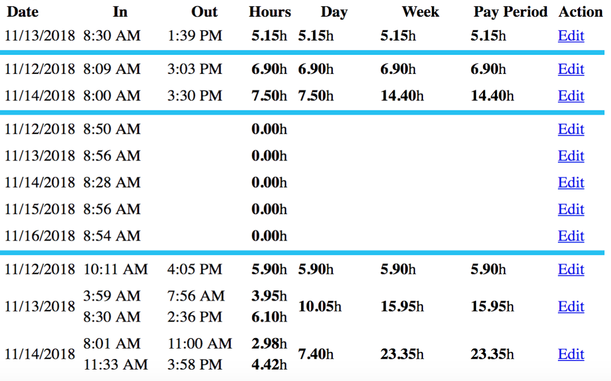
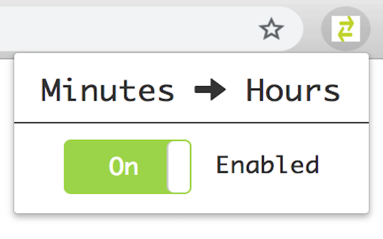

# Minutes to Hours - Chrome Extension
Converts minutes to hours in reports for easier transfer of values to external applications (such as Gusto).

| Before | After |
| ------ | ----- |
|   |  |

Functionality can be toggled via the extension popup to easily view the original time values. No need to entirely disable/enable the extension via Chrome's settings.

## Development
Install the local extension into Chrome:

1. Clone the repo
2. Navigate to `chrome://extensions` in Chrome
3. Toggle "Developer Mode" on in the top right-hand corner
4. Click "Load Unpacked" and select the `extension` directory in your file explorer

Once the extension is installed, you can test changes against `time_report_example.html`. The location of this file on disk will vary per person, so you'll need to update the definition in the `content_scripts.matches` list in the `manifest.json`.

## Publishing
Zip up the `extension` directory and upload it to the Google Chrome Web Store via the [Developer Dashboard](https://chrome.google.com/u/1/webstore/devconsole).